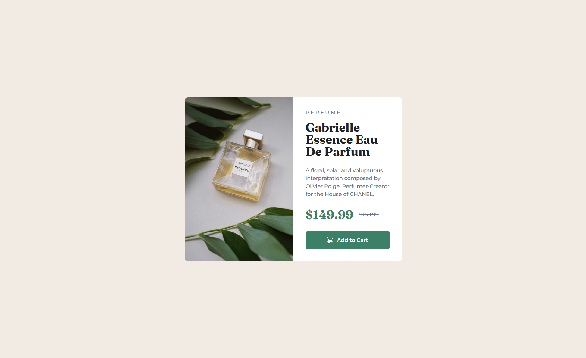

# Frontend Mentor - Product Preview Card Component Solution

This is my solution to the [Product Preview Card Component challenge on Frontend Mentor](https://www.frontendmentor.io/challenges/product-preview-card-component-GO7UmttRfa). The goal was to build a responsive product card using clean HTML and CSS that looks good on both desktop and mobile.

## Table of Contents

- [Overview](#overview)
  - [The Challenge](#the-challenge)
  - [Screenshot](#screenshot)
  - [Links](#links)
- [My Process](#my-process)
  - [Built With](#built-with)
  - [What I Learned](#what-i-learned)
  - [Continued Development](#continued-development)
  - [Useful Resources](#useful-resources)
- [Author](#author)

## Overview

### The Challenge

Users should be able to:

- View the optimal layout depending on their device's screen size.
- See hover states for interactive elements.

### Screenshot



### Links

- **Solution URL:** [GitHub Repository](https://github.com/LelloX-Dev/product-preview-card-repo)
- **Live Site URL:** [Live Preview](https://lellox-dev.github.io/product-preview-card-repo/)

## My Process

### Built With

- Semantic HTML5 markup.
- Custom CSS using variables.
- Flexbox & CSS Grid for layout.
- Mobile-first responsive design.
- Google Fonts: _Fraunces_ and _Montserrat_.

### What I Learned

I improved my understanding of responsive layout patterns using a combination of **Flexbox** and **CSS Grid**, as well as how to handle image switching between mobile and desktop:

```html


```

I also practiced using CSS custom properties for a more scalable and maintainable design system:

```css
:root {
  --Green-500: hsl(158, 36%, 37%);
  --Green-700: hsl(158, 42%, 18%);
}
```

### Continued Development

In future projects, I plan to:

- Improve accessibility (e.g., keyboard navigation and ARIA roles).
- Use a component-based approach via frameworks like React or Vue.
- Explore utility-first frameworks like Tailwind CSS for faster prototyping.

### Useful Resources

- [Frontend Mentor Starter Guide](https://www.frontendmentor.io/resources)
- [CSS Grid Layout – MDN](https://developer.mozilla.org/en-US/docs/Web/CSS/CSS_Grid_Layout)
- [Google Fonts](https://fonts.google.com/) – Great for quickly testing type combinations.
- [CSS Variables Guide](https://developer.mozilla.org/en-US/docs/Web/CSS/Using_CSS_custom_properties)

## Author

- **Frontend Mentor:** [@LelloX-Dev](https://www.frontendmentor.io/profile/LelloX-Dev)
- **GitHub:** [@LelloX-Dev](https://github.com/LelloX-Dev)
